# Pi Agent Loop 深度架构与运行机制全景解析

> **规范版本与源码基线**：
> - 高层会话编排层：`@earendil-works/pi-coding-agent` v1.0.2
> - 核心执行循环引擎：`@earendil-works/pi-agent-core` v1.0.2
> - 适用规范：严格遵循 ECMAScript/TypeScript 异步流模型与 Pi 架构约束

---

## 目录

1. [架构分层与核心职责边界](#1-架构分层与核心职责边界)
2. [Agent Loop 全景运行流程图 (Mermaid)](#2-agent-loop-全景运行流程图-mermaid)
3. [核心执行阶段与精确函数/API 流水线](#3-核心执行阶段与精确函数api-流水线)
   - [3.1 输入接收与流式并发管控 (Input Phase)](#31-输入接收与流式并发管控-input-phase)
   - [3.2 运行生命周期启动 (Lifecycle Start)](#32-运行生命周期启动-lifecycle-start)
   - [3.3 轮次准备与上下文装配 (Turn Preparation & Context Assembly)](#33-轮次准备与上下文装配-turn-preparation--context-assembly)
   - [3.4 模型请求与流式响应解析 (Model Generation & Streaming)](#34-模型请求与流式响应解析-model-generation--streaming)
   - [3.5 工具调度执行与保序回填 (Tool Call Dispatch & Execution)](#35-工具调度执行与保序回填-tool-call-dispatch--execution)
   - [3.6 单轮收尾与决策流转 (Turn End & Continuation Decision)](#36-单轮收尾与决策流转-turn-end--continuation-decision)
   - [3.7 运行终结与两阶段结算边界 (Settle & Termination Phase)](#37-运行终结与两阶段结算边界-settle--termination-phase)
4. [关键机制源码级深度剖析](#4-关键机制源码级深度剖析)
   - [4.1 动态工具声明与 Transcript 增量同步机制 (declareToolChanges)](#41-动态工具声明与-transcript-增量同步机制-declaretoolchanges)
   - [4.2 工具执行模式判定与保序流水线 (Sequential vs Parallel)](#42-工具执行模式判定与保序流水线-sequential-vs-parallel)
   - [4.3 嵌套工具调用、资源配额与上下文隔离 (Nested Tool Calls)](#43-嵌套工具调用资源配额与上下文隔离-nested-tool-calls)
   - [4.4 消息队列机制与分流语义 (Steering vs Follow-Up)](#44-消息队列机制与分流语义-steering-vs-follow-up)
   - [4.5 自动重试体系与指数退避算法 (Auto-Retry)](#45-自动重试体系与指数退避算法-auto-retry)
   - [4.6 上下文压缩机制精算 (Threshold Compaction vs Overflow Recovery)](#46-上下文压缩机制精算-threshold-compaction-vs-overflow-recovery)
   - [4.7 Prompt Cache 经济学评估与预热机制 (Cache Warmer)](#47-prompt-cache-经济学评估与预热机制-cache-warmer)
   - [4.8 两阶段会话结算机制 (agent_before_settle vs agent_settled)](#48-两阶段会话结算机制-agent_before_settle-vs-agent_settled)
5. [核心 API、Hook、方法与事件契约速查表](#5-核心-api-hook-方法与事件契约速查表)

---

## 1. 架构分层与核心职责边界

Pi 的智能体运行时采取严格的双层解耦架构设计，将**通用事件驱动状态机**与**特定业务/会话持久化编排**彻底拆分：

```
+-----------------------------------------------------------------------------------+
|                            Pi Host / Application Layer                            |
|             (Interactive TUI / RPC Server / CLI Integration / Print Mode)         |
+-----------------------------------------------------------------------------------+
                                         │
                                         ▼
+-----------------------------------------------------------------------------------+
|               Session & Extension Orchestration Layer (pi-coding-agent)           |
|                                                                                   |
|  - AgentSession: 核心会话门面，管理上下文生命周期、自动重试、压缩恢复、缓存预热    |
|  - SessionManager: JSONL 树形分支存储 (Branch Navigation, Context Edits, Forks)   |
|  - ExtensionRunner: 扩展插件事件调度、两阶段边界协商 (Turn/Settle)、沙箱隔离      |
|  - CacheWarmer: Prompt Cache 经济学估算、定时保活与空闲探测 (Idle Detection)       |
|  - NestedToolCallRunner: 嵌套工具调用沙箱、资源配额限制 (Nested Limits)           |
+-----------------------------------------------------------------------------------+
                                         │ (注入 AgentLoopConfig 回调与 StreamFn)
                                         ▼
+-----------------------------------------------------------------------------------+
|                     Core Loop Engine (@earendil-works/pi-agent-core)              |
|                                                                                   |
|  - Agent / runAgentLoop / runLoop: 双层事件循环 (外层 Follow-Up, 内层 Tools/Steer) |
|  - streamAssistantResponse: 协议规范化 (convertToLlm/normalizeContext)、流式解包  |
|  - executeToolCalls / runToolCall: 工具参数校验、拦截、并发/串行流水线、结果对齐   |
|  - declareToolChanges: 运行时工具集与 Transcript System 增量消息双向同步           |
|  - Steering / Follow-Up 队列: 纯内存消息排队与动态注入调度                        |
+-----------------------------------------------------------------------------------+
```

### 1.1 执行核心：`@earendil-works/pi-agent-core`
- **无持久化状态机**：不依赖磁盘、文件系统或具体数据库，仅依赖内存中的消息转录本（`transcript: AgentMessage[]`）驱动。
- **Transcript 即唯一真理源**：System Prompt、工具声明（Tools Declaration）、用户对话、模型响应、工具执行结果全部表达为 `AgentMessage` 序列；系统提示词和工具集增量均记录在 `role: "system"` 消息中。
- **确定的工具调用管道**：严密保证工具参数强校验（TypeBox）、拦截器（`beforeToolCall`/`afterToolCall`）、以及并行执行时的**结果顺序回填保序**。

### 1.2 会话编排层：`@earendil-works/pi-coding-agent`
- **树形持久化 (JSONL Session Tree)**：将会话历史持久化为具有父子指针的节点树，支持会话分支漫游（Tree Navigation）、快速 Fork 与软删除（Context Edit）。
- **生命周期兜底机制**：接管底层核心抛出的错误，负责**网络与服务过载的指数退避重试**（Auto-Retry）、**上下文超限的溢出压缩恢复**（Overflow Compaction）、以及**上下文利用率阈值压缩**（Threshold Compaction）。
- **插件系统与边界协商**：连接 `ExtensionRunner`，将插件 Hook（如 `input`、`before_agent_start`、`tool_call`、`tool_result`、`agent_before_settle`）与核心 Loop 的控制流严密缝合。

---

## 2. Agent Loop 全景运行流程图 (Mermaid)

```mermaid
flowchart TD
    classDef inputPhase fill:#e1f5fe,stroke:#0288d1,stroke-width:2px;
    classDef startPhase fill:#e8f5e9,stroke:#388e3c,stroke-width:2px;
    classDef loopPrep fill:#fff3e0,stroke:#f57c00,stroke-width:2px;
    classDef modelStream fill:#f3e5f5,stroke:#7b1fa2,stroke-width:2px;
    classDef toolExec fill:#fffde7,stroke:#fbc02d,stroke-width:2px;
    classDef turnEnd fill:#ede7f6,stroke:#512da8,stroke-width:2px;
    classDef settlePhase fill:#ffebee,stroke:#d32f2f,stroke-width:2px;

    %% 1. 输入接收阶段
    subgraph SubInput ["1. 输入接收与流式并发管控 (Input Phase)"]
        UI_Input["外部输入 (TUI / CLI / RPC / SDK)"] --> SessionPrompt["AgentSession.prompt(text, options)"]
        SessionPrompt --> Ext_Input{"ExtensionRunner.emitInput()"}
        Ext_Input -- "handled" --> PromptHandled["直接结束返回: disposition = handled"]
        Ext_Input -- "transform / continue" --> CheckStreaming{"会话是否处于流式中?<br/>(isStreaming === true)"}
        
        CheckStreaming -- "是 (流式进行中)" --> CheckStreamOpt{"PromptOptions.streamingBehavior?"}
        CheckStreamOpt -- "steer" --> QueueSteer["AgentSession.steer()<br/>推入转向队列 (steeringQueue)"]
        CheckStreamOpt -- "followUp" --> QueueFollowUp["AgentSession.followUp()<br/>推入后置队列 (followUpQueue)"]
        CheckStreamOpt -- "未提供" --> RejectPrompt["抛出错误 (Reject): 并发输入必须指定 steer 或 followUp"]
        QueueSteer --> PromptQueued["返回: disposition = queued"]
        QueueFollowUp --> PromptQueued

        CheckStreaming -- "否 (空闲状态)" --> CheckExtCmd{"是否为已注册扩展命令?<br/>(/command)"}
        CheckExtCmd -- "是" --> ExecExtCmd["执行扩展命令: runner.executeCommand()<br/>返回: disposition = handled"]
        CheckExtCmd -- "否" --> ExpandTpl["模板与技能展开: expandPromptTemplates()<br/>解析技能块 parseSkillBlock()"]
        ExpandTpl --> Hook_BeforeAgentStart["ExtensionRunner.emitBeforeAgentStart()<br/>(可注入系统/附加消息，或覆盖 forceSystemPrompt)"]
        Hook_BeforeAgentStart --> CallRunPrompt["调用 AgentSession._runAgentPrompt()"]
    end
    class UI_Input,SessionPrompt,Ext_Input,PromptHandled,CheckStreaming,CheckStreamOpt,QueueSteer,QueueFollowUp,RejectPrompt,PromptQueued,CheckExtCmd,ExecExtCmd,ExpandTpl,Hook_BeforeAgentStart,CallRunPrompt inputPhase;

    %% 2. 运行生命周期启动
    subgraph SubStart ["2. 运行生命周期启动 (Lifecycle Start)"]
        CallRunPrompt --> AgentPrompt["Agent.prompt(messages, options)"]
        AgentPrompt --> AgentRunWithLife["Agent.runWithLifecycle()"]
        AgentRunWithLife --> SetStreaming["标记 agent.state.isStreaming = true<br/>创建会话 AbortController"]
        SetStreaming --> EmitAgentStart["发射核心事件: agent_start<br/>(状态机正式流转)"]
    end
    class AgentPrompt,AgentRunWithLife,SetStreaming,EmitAgentStart startPhase;

    %% 3. 轮次准备与上下文装配
    subgraph SubLoopPrep ["3. 轮次准备与上下文装配 (Turn Preparation)"]
        EmitAgentStart --> OuterLoop{"外层循环 (Outer Loop):<br/>存在 followUp 或初始输入?"}
        OuterLoop -- "开始新轮次" --> InnerLoop{"内层循环 (Inner Loop):<br/>存在待执行工具调用或待处理消息?"}
        
        InnerLoop -- "是" --> Hook_PrepareNextTurn["AgentLoopConfig.prepareNextTurn()"]
        Hook_PrepareNextTurn --> SessionNextTurn["AgentSession._installAgentNextTurnRefresh()<br/>检查前置压缩 / 更新动态工具 Loadout 消息"]
        
        SessionNextTurn --> EmitTurnStart["发射事件: turn_start (turnIndex, timestamp)"]
        EmitTurnStart --> DrainSteering["排干转向队列: drainQueue(steeringQueue)<br/>(根据 steeringMode: one-at-a-time 或 all)"]
        DrainSteering --> AppendPending["将待发消息追加至 Context Messages"]
        
        AppendPending --> DeclareToolChanges["核心同步函数: declareToolChanges()<br/>比较 context.tools 与 transcript 系统声明<br/>计算 toolsAdded/toolsRemoved 差集并注入增量 System 消息"]
        
        DeclareToolChanges --> Hook_PrepareReq["AgentLoopConfig.prepareRequest()"]
        Hook_PrepareReq --> SessionPrepareReq["AgentSession._installAgentRequestProjection():<br/>1. 路由虚拟模型 (Virtual Model Entry)<br/>2. Threshold Compaction 阈值检测与自动执行<br/>3. SessionManager.buildSessionProjection() 构建规范上下文"]
        
        SessionPrepareReq --> Hook_TransformCtx["AgentLoopConfig.transformContext()"]
        Hook_TransformCtx --> Ext_Context["ExtensionRunner.emitContext():<br/>阶段一: context 事件 (仅纯对话，System 被保护保护)<br/>阶段二: context_with_system 事件 (完整 Transcript)"]
        
        Ext_Context --> FilterHidden["_installHiddenDeclarationsProjection():<br/>从 System 消息中剔除 hiddenDeclarations 工具"]
        FilterHidden --> ConvertToLlm["AgentLoopConfig.convertToLlm()<br/>将 AgentMessage[] 转换为 LLM 协议格式"]
        ConvertToLlm --> ResolveApiKey["AgentLoopConfig.getApiKey() -> 鉴权与 API Key 解析"]
    end
    class OuterLoop,InnerLoop,Hook_PrepareNextTurn,SessionNextTurn,EmitTurnStart,DrainSteering,AppendPending,DeclareToolChanges,Hook_PrepareReq,SessionPrepareReq,Hook_TransformCtx,Ext_Context,FilterHidden,ConvertToLlm,ResolveApiKey loopPrep;

    %% 4. 模型生成与流式解析
    subgraph SubModelStream ["4. 模型请求与流式解析 (Model Generation)"]
        ResolveApiKey --> Hook_BeforeReq["ExtensionRunner.emitBeforeProviderRequest()"]
        Hook_BeforeReq --> Hook_BeforeHeaders["ExtensionRunner.emitBeforeProviderHeaders()"]
        Hook_BeforeHeaders --> CallStreamFn["调用 streamFn(messages, options)"]
        
        CallStreamFn --> StreamLoop{"消费流事件 (AssistantMessageEventStream)"}
        StreamLoop -- "text_delta / thinking_delta" --> EmitMsgUpdate["发射事件: message_update<br/>更新 agent.state.streamingMessage"]
        StreamLoop -- "tool_call_chunk" --> AccumulateToolCall["流式累积工具调用声明与 JSON 参数分块"]
        
        StreamLoop -- "stream 结束" --> EmitMsgEnd["发射事件: message_end (AssistantMessage)<br/>持久化 SessionMessageEntry<br/>ExtensionRunner.emitMessageEnd() 允许内容篡改"]
        EmitMsgEnd --> AppendAssistantMsg["将 AssistantMessage 追加到 Transcript"]
        
        AppendAssistantMsg --> CheckStopReason{"判定 AssistantMessage.stopReason"}
        CheckStopReason -- "error 或 aborted" --> HardExit["硬退出路径: hasMoreToolCalls = false<br/>记录 errorMessage"]
        CheckStopReason -- "length (输出上下文截断)" --> TruncatedFail["failToolCallsFromTruncatedMessage()<br/>全部未完成工具转为错误结果，引导模型缩短参数重发"]
        CheckStopReason -- "stop 或 tool_use" --> CheckToolCalls{"响应中是否存在 toolCalls?"}
    end
    class Hook_BeforeReq,Hook_BeforeHeaders,CallStreamFn,StreamLoop,EmitMsgUpdate,AccumulateToolCall,EmitMsgEnd,AppendAssistantMsg,CheckStopReason,HardExit,TruncatedFail,CheckToolCalls modelStream;

    %% 5. 工具执行与回填
    subgraph SubToolExec ["5. 工具调度执行与保序回填 (Tool Pipeline)"]
        CheckToolCalls -- "无工具调用" --> SkipTools["hasMoreToolCalls = false"]
        CheckToolCalls -- "存在工具调用" --> CheckParallel{"判断执行模式:<br/>config.toolExecution === sequential<br/>或存在 sequential 工具?"}
        
        CheckParallel -- "顺序执行 (Sequential)" --> ExecSeq["串行流水线: 依次 准备 -> 执行 -> 终结"]
        CheckParallel -- "并行执行 (Parallel)" --> ExecParallel["并行流水线: 串行准备 -> Promise.all 执行 -> 顺序收集"]
        
        subgraph ToolPipeline ["单个工具生命周期管线"]
            PrepTool["1. 准备阶段 (prepareToolCall):<br/>- 检查 AbortSignal<br/>- 查找工具定义与动态 Loadout<br/>- prepareArguments() 参数兼容转换<br/>- validateToolArguments() TypeBox 校验<br/>- Hook: beforeToolCall (触发插件 tool_call)"]
            PrepTool --> CheckBlocked{"插件是否返回 block: true?"}
            CheckBlocked -- "是" --> ReturnBlockErr["直接生成错误 ToolResult (blocked reason)"]
            CheckBlocked -- "否" --> RunExec["2. 执行阶段 (executePreparedToolCall):<br/>- 发射: tool_execution_start<br/>- 调用 tool.execute(params, signal, onUpdate, ctx)<br/>- 异常捕获 -> 转换为 isError ToolResult<br/>- 发射: tool_execution_end (带 durationMs)"]
            RunExec --> FinalizeTool["3. 终结阶段 (finalizeExecutedToolCall):<br/>- Hook: afterToolCall (触发插件 tool_result)<br/>- 图片尺寸归一化 (imageLimits 缩放)"]
            ReturnBlockErr --> FinalizeTool
        end

        ExecSeq --> ToolPipeline
        ExecParallel --> ToolPipeline
        
        FinalizeTool --> AppendToolResultMsgs["将 ToolResult 严格按 Assistant 发出顺序<br/>组装为 ToolResultMessage 并追加至 Transcript"]
        AppendToolResultMsgs --> CheckTerminateHint{"shouldTerminateToolBatch():<br/>当前批次所有工具是否均显式返回 terminate: true?"}
        CheckTerminateHint -- "是" --> SetTerminateFlag["标记: terminateBatch = true<br/>hasMoreToolCalls = false"]
        CheckTerminateHint -- "否" --> KeepLoop["标记: hasMoreToolCalls = true (驱动内层再循环)"]
    end
    class CheckToolCalls,SkipTools,CheckParallel,ExecSeq,ExecParallel,PrepTool,CheckBlocked,ReturnBlockErr,RunExec,FinalizeTool,AppendToolResultMsgs,CheckTerminateHint,SetTerminateFlag,KeepLoop toolExec;

    %% 6. 轮次收尾与决策流转
    subgraph SubTurnEnd ["6. 轮次收尾与决策流转 (Turn End & Decision)"]
        HardExit --> TurnFinish
        TruncatedFail --> TurnFinish
        SkipTools --> TurnFinish
        SetTerminateFlag --> TurnFinish
        KeepLoop --> TurnFinish

        TurnFinish["执行 Hook: AgentLoopConfig.finishTurn()<br/>AgentSession 触发 Turn End 边界事件 (带 message 与 toolResultIds)"] --> CheckFinishAction{"finishTurn() 返回 Action?"}
        CheckFinishAction -- "end" --> ForceEnd["强制终止: pendingMessages = []<br/>hasMoreToolCalls = false"]
        CheckFinishAction -- "continue" --> ForceContinue["强制继续: 确保驱动下一轮模型请求"]
        CheckFinishAction -- "默认行为" --> NormalFlow["根据队列与工具调用状态自决流转"]
        
        ForceEnd --> EmitTurnEnd["发射事件: turn_end<br/>记录 errorMessage"]
        ForceContinue --> EmitTurnEnd
        NormalFlow --> EmitTurnEnd
        
        EmitTurnEnd --> FlushCustom["AgentSession._flushPendingCustomMessages()<br/>落盘流式期间暂存的 Custom Messages"]
        FlushCustom --> InnerLoop
        
        InnerLoop -- "否 (当前轮无工具且无待处理消息)" --> CheckFollowUp{"检查后置队列:<br/>hasQueuedMessages(followUpQueue)?"}
        CheckFollowUp -- "存在 Follow-Up 消息" --> DrainFollowUp["排干一条或全部 Follow-Up 消息<br/>注入为 pendingMessages"]
        DrainFollowUp --> OuterLoop
        CheckFollowUp -- "无 Follow-Up 消息" --> EndRunLoop["退出主运行循环 (Run Loop Exit)"]
    end
    class TurnFinish,CheckFinishAction,ForceEnd,ForceContinue,NormalFlow,EmitTurnEnd,FlushCustom,CheckFollowUp,DrainFollowUp,EndRunLoop turnEnd;

    %% 7. 结算边界与终结
    subgraph SubSettle ["7. 运行终结与两阶段结算边界 (Settle Phase)"]
        EndRunLoop --> EmitAgentEnd["发射事件: agent_end<br/>(携带本次 run 产生消息集与 willRetry 标志)"]
        EmitAgentEnd --> CheckRecovery{"检查容错与恢复策略"}
        
        CheckRecovery -- "Context Overflow 溢出" --> OverflowCompaction["执行 Overflow Compaction 紧急压缩<br/>从 Transcript 软删除失败轮次 (Context Edit)<br/>重放请求 agent.continue()"]
        CheckRecovery -- "暂态错误 (429/500/503/529)" --> CheckRetryBudget{"检查 Auto-Retry 预算<br/>(retryAttempt < maxRetries)?"}
        
        CheckRetryBudget -- "配额有效" --> AutoRetry["计算指数退避 delayMs<br/>发射 auto_retry_start<br/>倒计时唤醒后发起 _runAgentPrompt() 重试"]
        CheckRetryBudget -- "配额耗尽" --> FinalFail["发射 auto_retry_end (success: false)<br/>抛出最终错误"]
        
        CheckRecovery -- "正常完成 (Success)" --> SettleBoundary["第一阶段: 结算前协商 (agent_before_settle)<br/>ExtensionRunner.emitBoundary()"]
        
        SettleBoundary --> CheckSettleCont{"插件是否返回 continue: true<br/>或追加了有效 entries?"}
        CheckSettleCont -- "是" --> ApplyDrafts["应用 Draft Entries 至 SessionManager<br/>调用 _runAgentPrompt() 开启新一轮交互"]
        CheckSettleCont -- "否" --> CommitDrafts["永久提交 Draft Entries 到 SessionManager"]
        
        CommitDrafts --> EmitAgentSettled["第二阶段: 终结通知 (agent_settled)<br/>只读通知事件，不可再修改状态"]
        EmitAgentSettled --> TriggerCacheWarmer["CacheWarmer.onAgentSettled()<br/>切换为空闲预热模式 (Idle Phase, 30min 上限)"]
        TriggerCacheWarmer --> ExecDeferredActions["执行延迟动作 (Deferred Settled Actions)"]
        ExecDeferredActions --> ResetStreaming["重置 agent.state.isStreaming = false<br/>释放 AbortController"]
        ResetStreaming --> IdlePromise["isIdle 变为 true<br/>session.prompt() Promise 正式 Resolve！"]
    end
    class EmitAgentEnd,CheckRecovery,OverflowCompaction,CheckRetryBudget,AutoRetry,FinalFail,SettleBoundary,CheckSettleCont,ApplyDrafts,CommitDrafts,EmitAgentSettled,TriggerCacheWarmer,ExecDeferredActions,ResetStreaming,IdlePromise settlePhase;
```



---

## 3. 核心执行阶段与精确函数/API 流水线

### 3.1 输入接收与流式并发管控 (Input Phase)
- **公开入口**：`AgentSession.prompt(text, options)`（支持 CLI、Interactive TUI、RPC、SDK 编程式调用）。
- **扩展输入拦截与改写**：
  - 调用 `ExtensionRunner.emitInput(text, images, source, streamingBehavior)`。
  - 若插件返回 `{ action: "handled" }`，直接短路终结，函数返回 `{ disposition: "handled" }`。
  - 若插件返回 `{ action: "transform", text, images }`，输入的提示词与附件图像被链式改写。
- **并发与流式状态互斥检测**：
  - 当 `session.isStreaming === true` 时，智能体正在执行模型推理或工具调用，禁止直接打断：
    - 检查 `options.streamingBehavior`：
      - `"steer"`：调用 `session.steer()` -> `agent.steer()`，将消息推入转向队列，返回 `{ disposition: "queued" }`。
      - `"followUp"`：调用 `session.followUp()` -> `agent.followUp()`，将消息推入后置队列，返回 `{ disposition: "queued" }`。
      - 未提供：立即抛出 `Error("Session is already streaming...")`，强行拒绝未经流式分流意图标记的并发输入。
- **命令解析与模板展开**：
  - 若智能体处于空闲状态，检测 `/command` 语法：
    - 若命中注册的扩展命令，调用 `runner.executeCommand()` 并在执行后返回 `{ disposition: "handled" }`。
  - 普通文本经 `expandPromptTemplates()` 解析，展开模板参数与 Skill 代码块（`parseSkillBlock()`）。
- **启动前 Hook 触发**：
  - 调用 `ExtensionRunner.emitBeforeAgentStart(prompt, images, systemPromptOptions)`。
  - 插件可在该 Hook 中返回 `{ message }` 注入额外的前置消息，或通过 `result.systemPrompt` 强行覆盖本次运行的 System Prompt。

### 3.2 运行生命周期启动 (Lifecycle Start)
- **底层流转**：`session._runAgentPrompt()` -> `agent.prompt(messages, options)` -> `agent.runWithLifecycle()`。
- **状态初始化与流式锁定**：
  - 创建专属于本次运行的 `AbortController`，并将其与外层传入的取消信号绑定。
  - 标记 `agent.state.isStreaming = true`。
- **首发通知**：
  - 派发 `agent_start` 事件，所有订阅监听器（TUI 渲染层、监控钩子）开始接收流。
  - 针对初始用户输入消息，派发 `message_start` 与 `message_end`，落盘至持久化历史。

### 3.3 轮次准备与上下文装配 (Turn Preparation & Context Assembly)
进入核心 `runLoop`，每个轮次（Turn）开始前执行严密的上下文准备流水线：
1. **轮次生命周期与跨轮刷新**：
   - 触发 `AgentLoopConfig.prepareNextTurn()` -> 绑定在 `AgentSession._installAgentNextTurnRefresh()`。
   - 检查并在下一次 Assistant 回复前执行必须完成的前置刷新（如动态工具集变更通知）。
   - 发射 `turn_start` 事件（携带递增的 `turnIndex` 与时间戳）。
2. **转向消息注入 (Steer Queue Drain)**：
   - 检查并排干 `agent.steeringQueue` 中的消息（依据 `steeringMode`：`"one-at-a-time"` 仅取一条，`"all"` 取全部）。
3. **动态工具声明同步 (`declareToolChanges`)**：
   - 对比当前执行上下文拥有的工具列表 `context.tools` 与 Transcript 最新 System 消息中记录的工具声明。
   - 若检测到差异，计算 `toolsAdded` 与 `toolsRemoved` 差集，并插入增量 `role: "system"` 消息。
4. **规范上下文构建与自动压缩检测 (`prepareRequest`)**：
   - 触发 `AgentLoopConfig.prepareRequest()` -> `AgentSession._installAgentRequestProjection()`。
   - 路由虚拟模型（Virtual Model），并在 Transcript 中插入 `VIRTUAL_MODEL_STATE_ENTRY` 追踪节点。
   - 运行 `shouldCompact()` 算法：若上下文估算 Token 超出阈值，自动在请求前触发 Threshold Compaction。
   - 从 `SessionManager` 构建规范消息投影（Canonical Context Projection）。
5. **扩展插件两阶段上下文改写 (`transformContext`)**：
   - 第一阶段派发 `context` 事件：向插件暴露剥离了 System 消息的纯对话列表；插件修改完毕后，Pi 自动将 System 提示词与工具增量消息原样缝合复原。
   - 第二阶段派发 `context_with_system` 事件：向插件暴露包含 System 消息的完整 Transcript（允许高级插件进行深度定制）。
   - 执行隐藏声明过滤投影（`_installHiddenDeclarationsProjection`）：从发送给模型的 System 消息中剔除标记为 `hiddenDeclarations` 的工具。
6. **协议转换与鉴权准备**：
   - 调用 `AgentLoopConfig.convertToLlm()`，将内部的 `AgentMessage[]` 转换为主流 Provider 兼容的结构。
   - 调用 `AgentLoopConfig.getApiKey()` 解析并校验对应模型的凭证。

### 3.4 模型请求与流式响应解析 (Model Generation & Streaming)
- **网络层拦截 Hook**：
  - 调用 `ExtensionRunner.emitBeforeProviderRequest(payload)` 允许篡改最终发送给模型的 JSON Body。
  - 调用 `ExtensionRunner.emitBeforeProviderHeaders(headers)` 允许动态注入身份标识或计费头。
- **流式消费与事件派发**：
  - 调用 `streamFn(messages, options)`（返回 `AssistantMessageEventStream`）。
  - 解析 `text_delta` / `thinking_delta`：派发 `message_update` 事件，驱动终端高频打字机动画渲染。
  - 解析 `tool_call_chunk`：动态累积工具调用 ID、名称与 JSON 参数分块。
- **流终结处理**：
  - 流读取完毕，组装出最终的 `AssistantMessage`。
  - 发射 `message_end` 事件。
  - 触发 `ExtensionRunner.emitMessageEnd()` 允许插件对生成的内容做最终审查或修正。
  - 将 `AssistantMessage` 追加到 Transcript 并持久化为 `SessionMessageEntry`。
- **Stop Reason 分支判定**：
  - 若 `stopReason === "error"` 或 `"aborted"`：进入硬退出流程，终止内层循环，记录错误并跳向收尾。
  - 若 `stopReason === "length"`（输出 Token 耗尽截断）：调用 `failToolCallsFromTruncatedMessage()`，将截断的工具调用生成针对性错误结果，提示模型缩短参数重新生成。
  - 若包含有效的 `toolCalls`：进入工具调度管线；若无工具调用，标记 `hasMoreToolCalls = false`。

### 3.5 工具调度执行与保序回填 (Tool Call Dispatch & Execution)
- **并发策略判定**：
  - 检查配置 `config.toolExecution` 是否为 `"sequential"`，或当前被调用的工具中是否存在任意一个声明了 `executionMode: "sequential"`。
  - 若命中上述任一条件，当前批次所有工具降级为**串行执行**；否则默认采用**并行执行**。
- **单工具生命周期流水线**：
  1. **准备阶段 (`prepareToolCall`)**：
     - 检查 `AbortSignal` 是否已被中止。
     - 从动态 Loadout 中检索工具定义。
     - 调用工具自带的 `prepareArguments()` 做向下兼容转换。
     - 运行 `validateToolArguments()` 执行 TypeBox JSON Schema 强类型校验。
     - 触发 `AgentLoopConfig.beforeToolCall` -> 触发插件 `tool_call` 事件：
       - 若插件返回 `{ block: true, reason }`，拦截工具运行，直接生成携带拒绝原因的错误 `ToolResult`。
  2. **执行阶段 (`executePreparedToolCall`)**：
     - 发射 `tool_execution_start` 事件。
     - 调用核心执行体：`tool.execute(toolCallId, params, signal, onUpdate, ctx)`。
     - 异常捕获：将任何未捕获异常转化为 `{ isError: true, content: [{ type: "text", text: error.message }] }`。
     - 发射 `tool_execution_end` 事件（携带耗时 `durationMs`）。
  3. **终结阶段 (`finalizeExecutedToolCall`)**：
     - 触发 `AgentLoopConfig.afterToolCall` -> 触发插件 `tool_result` 事件（允许修改输出内容、剥离敏感信息）。
     - 图片尺寸自动化归一化：若结果包含图片，按模型供应商规格限制自动执行降采样与缩放。
- **结果保序回填**：
  - **关键保序约束**：即使工具并发执行且完成时间不同，回填给模型的 `ToolResultMessage` 必须严格按照模型发起调用的原始顺序写入 Transcript。
- **批次终止判定**：
  - 调用 `shouldTerminateToolBatch(toolResults)`：**仅当批次非空且所有工具结果均显式返回 `terminate: true` 时**，才将终止标记置为 true，结束后续轮次。

### 3.6 单轮收尾与决策流转 (Turn End & Continuation Decision)
1. **Finish Turn 钩子决策**：
   - 触发 `AgentLoopConfig.finishTurn()` -> `AgentSession._installAgentBoundaryHooks`。
   - 派发插件 `turn_end` 边界事件（携带本轮 Message、ToolResults 及其持久化 Entry ID）。
   - 若 Hook 返回 `{ action: "end" }`：强行清空待发消息，终止智能体流转。
   - 若 Hook 返回 `{ action: "continue" }`：强制驱动下一轮模型请求。
2. **发射轮次结束事件**：
   - 发射 `turn_end` 事件。
3. **暂存自定义消息刷新**：
   - 调用 `AgentSession._flushPendingCustomMessages()`，落盘流式期间排队的自定义消息，确保不破坏 ToolUse/ToolResult 的连续性。
4. **内层与外层循环判断**：
   - 若内层仍有未处理的工具结果或转向消息，重复执行内层循环。
   - 当内层完全结束且无更多待执行工具时，检查后置队列（`agent.followUpQueue`）。
   - 若存在 Follow-Up 消息，排干消息并重新启动外层循环；否则正式退出主循环。

### 3.7 运行终结与两阶段结算边界 (Settle & Termination Phase)
1. **发射 `agent_end`**：
   - 主循环退出后，立即发射 `agent_end` 事件（携带本 Run 累计产生的消息及 `willRetry` 状态）。
2. **容错重试与恢复判定**：
   - 若遭遇上下文超长，触发 Overflow Compaction，执行软删除重放。
   - 若遭遇暂态错误且重试次数未超限，触发 Auto-Retry 倒计时。
3. **两阶段会话结算机制**：
   - **第一阶段 (`agent_before_settle`)**：
     - 调用 `ExtensionRunner.emitBoundary({ type: "agent_before_settle" })`。
     - 插件可在该边界提交新的 Draft Entries，甚至返回 `{ continue: true }` 要求重新开启一轮智能体交互（例如自动总结、安全检查或追问）。
   - **第二阶段 (`agent_settled`)**：
     - 确认无进一步请求后，将所有 Draft Entries 永久提交（Commit）到 SessionManager。
     - 发射只读的通知事件 `agent_settled`。
4. **缓存预热模式切换与资源释放**：
   - `CacheWarmer.onAgentSettled()` 将保活模式切换为 Idle 模式。
   - 执行所有在结算期间排队的延迟动作（`_deferredSettledActions`）。
   - 将 `agent.state.isStreaming` 翻转为 `false`。
   - `session.prompt()` 返回的 Promise 正式 Resolve。

---

## 4. 关键机制源码级深度剖析

### 4.1 动态工具声明与 Transcript 增量同步机制 (`declareToolChanges`)
Pi 采取了独特的“**Transcript 增量工具契约**”设计：
```ts
// pi-agent-core/dist/agent-loop.js
function declareToolChanges(currentTools, transcript) {
    const declaredTools = getDeclaredTools(transcript);
    const toolsAdded = currentTools.filter(t => !declaredTools.has(t.name));
    const toolsRemoved = Array.from(declaredTools).filter(name => !currentTools.some(t => t.name === name));
    if (toolsAdded.length === 0 && toolsRemoved.length === 0) return;
    
    // 构造增量变更并插入 System 消息
    injectSystemMessageUpdate(transcript, { toolsAdded, toolsRemoved });
}
```
- 运行时通过 `session.setActiveToolsByName()` 动态增删工具时，不会暴力重写历史。
- 计算出差异后，增量信息被编码在一条新的 `role: "system"` 消息的 `toolsAdded` 与 `toolsRemoved` 字段中。
- **设计收益**：无论是会话回放、跨分支切换还是会话 Fork，重放 Transcript 任意历史节点均能精确复现当时模型所能感知的完整工具集。

### 4.2 工具执行模式判定与保序流水线 (Sequential vs Parallel)
`pi-agent-core` 对工具并发执行做了极严密的防乱序处理：
- **Parallel 模式**：
  - 先串行依次调用各工具调用的 `prepareToolCall`（确保参数校验和 `beforeToolCall` 拦截顺序严格一致）。
  - 使用 `Promise.all` 并发启动所有准备就绪的工具。
  - 各工具异步执行完毕后，立即按自身完成时间发射 `tool_execution_end`（让 TUI 能够第一时间显示最快完成的工具）。
  - **关键保序**：生成回填给模型的 `ToolResultMessage` 时，严格按照原始 Assistant 响应中发起的工具顺序重排，确保与底层模型 API 的严格校验完全契合。
- **Sequential 模式**：
  - 一个工具完全执行完毕、终结并追加结果后，才开始下一个工具的准备与执行。

### 4.3 嵌套工具调用、资源配额与上下文隔离 (Nested Tool Calls)
通过 `NestedToolCallRunner`（`dist/core/nested-tool-calls.js`），Pi 允许在宿主工具（如 `codemode`）内部通过 `ctx.executeTool(name, args)` 递归调用其他原生工具。为防止无限死循环和内存爆炸，Pi 设置了极严密的**硬编码配额边界**：

```ts
export const NESTED_CALL_LIMITS = {
    maxCalls: 256,                       // 单个父工具调用内最多允许 256 次嵌套调用
    maxArgumentBytesPerCall: 8 * 1024,   // 单次嵌套调用的参数最大允许 8 KB
    maxArgumentBytesTotal: 32 * 1024,    // 累计嵌套调用的参数最大允许 32 KB
    maxErrorChars: 500,                  // 错误文本最长截断为 500 字符
};
```

- **派生标识与事件拓扑**：嵌套调用的 ID 自动生成为 `"<parentToolCallId>/<index>"`（例如 `call_abc123/0`）。所有 `tool_execution_start/end` 事件均显式携带 `parentToolCallId`，使得 TUI 或外部观测台能以树状层级渲染子工具执行。
- **上下文纯净度隔离**：嵌套调用的结果**绝对不会**作为顶级 `toolResult` 消息追加到核心 Transcript 中，而是以摘要结构记录在父工具结果的 `details.nestedCalls` 中，从而确保主对话上下文结构稳定合法。

### 4.4 消息队列机制与分流语义 (Steering vs Follow-Up)
当 `isStreaming === true` 时，外部输入被拦截分流至两个具有不同执行时机的内存队列：

| 队列类型 | API 入口 | 排干时机 (Drain Point) | 适用场景与语义 |
| :--- | :--- | :--- | :--- |
| **转向队列 (Steering)** | `agent.steer()` / `session.steer()` | **当前轮次 Assistant 与工具全部执行完成后，发起下一轮模型请求之前** | “**立刻干预**”：例如发现模型正在朝错误方向修改文件，插入指令修正下一步动作 |
| **后置队列 (Follow-Up)** | `agent.followUp()` / `session.followUp()` | **当前任务所有工具链条完全结束、智能体即将空闲停机之前** | “**做完之后再做**”：例如“把当前任务改完后，顺便把 README 也更新一下” |

- **队列模式流控**：
  - `steeringMode` / `followUpMode` 支持 `"one-at-a-time"`（默认，每次排干仅取最老的一条，防止多条指令互相干扰）与 `"all"`（一次性排干全部）。
- **扩展命令防死锁**：在流式过程中尝试向队列排入扩展命令（如 `/exit`）会直接抛错，强制要求在非流式状态下同步执行。

### 4.5 自动重试体系与指数退避算法 (Auto-Retry)
Pi 内置了企业级弹性的自动重试机制（`_prepareRetry`）：
- **可重试错误识别**：
  - HTTP 429（Rate Limit Exceeded）。
  - HTTP 500 / 502 / 503 / 529（Provider Overloaded）。
  - 瞬态网络连接重置或超时。
- **指数退避计算公式**：
  ```ts
  // 基础退避公式：min(maxDelayMs, baseDelayMs * 2^(attempt - 1)) + 随机抖动 (Jitter)
  const delayMs = retryDelayMs(settings, this._retryAttempt);
  ```
- **重试上限与历史回滚**：
  - 默认最大重试次数为 `settings.maxRetries`（通常为 3 次）。
  - 触发重试时发射 `auto_retry_start`，成功后发射 `auto_retry_end (success: true)` 并将 `_retryAttempt` 归零。
  - **历史软删除**：通过 `_omitRecoveryAttempt(message)` 生成 `context_edit` 节点，将失败的模型请求从模型可见的规范上下文中剥离，避免污染后续重试请求的上下文。

### 4.6 上下文压缩机制精算 (Threshold Compaction vs Overflow Recovery)
Pi 提供了两种截然不同的上下文压缩触发路径：

```
+-----------------------------------------------------------------------------------+
|                        上下文压缩判定流 (Compaction Logic)                        |
+-----------------------------------------------------------------------------------+
                                         │
                 ┌───────────────────────┴───────────────────────┐
                 ▼                                               ▼
   [Threshold Compaction (预先预防)]              [Overflow Recovery (紧急恢复)]
   触发时机: 请求前 (prepareRequest)               触发时机: 模型请求失败返回后
   触发条件:                                      触发条件:
   contextTokens > contextWindow - reserveTokens  stopReason === "error" &&
   默认 reserveTokens = 16384                     isContextOverflow(message)
                 │                                               │
                 ▼                                               ▼
   执行 prepareCompaction()                       软删除失败请求 (_omitRecoveryAttempt)
   生成 CompactionEntry 摘要截断历史               执行紧急 Compaction 压缩
   无缝发起正常模型请求                            调用 agent.continue() 自动重试
```

1. **Threshold Compaction (阈值压缩)**：
   - 算法：`shouldCompact(contextTokens, contextWindow, settings)`。
   - 核心判断：当估算上下文 Token 超过 `contextWindow - reserveTokens` 时触发。
   - 采用纯前端保守估算（基于字符长度与真实 Provider Token 统计）。
2. **Overflow Recovery (溢出紧急恢复)**：
   - 当 Provider 返回错误且被 `isContextOverflow()` 判定为上下文窗口硬超限时触发。
   - 标记 `_overflowRecoveryAttempted = true`（防止无限死循环压缩，单次 Run 仅允许尝试一次）。
   - 将导致超限的失败请求及其关联结果从规范投影中软删除，随后执行紧凑压缩并无缝重试。

### 4.7 Prompt Cache 经济学评估与预热机制 (Cache Warmer)
针对支持 Prompt Cache 的前沿模型（如 Anthropic Claude 3.5/3.7），Pi 引入了革命性的 `CacheWarmer` 保活引擎：
- **触发时机与延迟精算**：
  ```ts
  export function getCacheWarmingDelayMs(ttlMs) {
      if (ttlMs <= 10_000) return undefined;
      // 在 TTL 的 90% 时间点触发预热，且至少预留 10 秒安全裕量
      return Math.max(1, Math.floor(Math.min(ttlMs * 0.9, ttlMs - 10_000)));
  }
  ```
- **经济学价值评估函数 (`evaluate`)**：
  - 只有当预热所节省的费用期望值满足条件时才执行保活：
    ```ts
    expectedSavings = (missCost - warmCost) * continuationProbability;
    action = expectedSavings >= CACHE_WARMING_MINIMUM_EXPECTED_SAVINGS ? "warm" : "let_expire";
    ```
- **扩展决策拦截**：触发预热前发射 `cache_warming_decision` 事件，允许自定义插件强行覆盖 `action`（`warm` 或 `let_expire`）。
- **空闲与流式两阶段流转**：
  - **流式阶段 (Streaming Phase)**：最长保活窗口为 60 分钟（`MAX_WARMING_AGE_MS`）。
  - **空闲阶段 (Idle Phase)**：在 `agent_settled` 触发后无缝转入空闲保活，空闲保活上限收缩至 30 分钟（`MAX_IDLE_WARMING_AGE_MS`），继续概率固定估算为 15%（`IDLE_CONTINUATION_PROBABILITY`）。

### 4.8 两阶段会话结算机制 (agent_before_settle vs agent_settled)
为了解决“插件想要在智能体结束时介入检查，但直接发消息容易破坏调用栈”的经典问题，Pi 划分了严密的结算两阶段：
- **`agent_before_settle` (最后可操作边界)**：
  - 属于**可变协商边界**。
  - 扩展插件可通过返回 `{ entries, continue: true }` 注入审查意见或新任务，并命令核心引擎重新启动一轮 LLM 交互。
- **`agent_settled` (终态通知边界)**：
  - 属于**纯只读通知事件**。
  - 此时所有 Draft 变更均已提交至 `SessionManager` 落盘，状态机即将完全释放，禁止再发起新的轮次或修改消息。

---

## 5. 核心 API、Hook、方法与事件契约速查表

| 名称 | 类型 | 模块/层级 | 契约签名 / 触发时机与职责 |
| :--- | :--- | :--- | :--- |
| **`session.prompt()`** | 核心入口 API | `AgentSession` | `(text: string, options?: PromptOptions) => Promise<PromptDispositionResult>`；接收外部交互，调度命令、模板与队列状态 |
| **`agent.steer()`** | 队列 API | `Agent` | `(message: AgentMessage) => void`；推入转向队列，在当前轮次工具执行后立即插队 |
| **`agent.followUp()`** | 队列 API | `Agent` | `(message: AgentMessage) => void`；推入后置队列，在智能体彻底空闲时注入 |
| **`input`** | 扩展 Hook/Event | `ExtensionRunner` | 输入文本解析前触发；可返回 `{ action: "handled" }` 短路或 `{ action: "transform", text, images }` 改写 |
| **`before_agent_start`** | 扩展 Hook/Event | `ExtensionRunner` | Run 启动前触发；可返回 `{ message }` 注入消息或 `{ systemPrompt }` 强行覆盖系统提示词 |
| **`agent_start`** | 核心生命周期事件 | `Agent` / Session | 状态机初始化完毕，进入流式运行状态 |
| **`turn_start`** | 轮次生命周期事件 | `Agent` / Session | 某一轮 LLM 交互开始，包含 `turnIndex` 与时间戳 |
| **`declareToolChanges`** | 核心内部函数 | `pi-agent-core` | `(currentTools, transcript) => void`；比较当前工具集与 Transcript 系统消息差集，注入增量声明 |
| **`prepareRequest`** | 核心 Loop Hook | `AgentLoopConfig` | 构造规范上下文投影、检查自动压缩阈值、路由虚拟模型 |
| **`transformContext`** | 核心 Loop Hook | `AgentLoopConfig` | 驱动 `context` 与 `context_with_system` 两阶段扩展修改管道 |
| **`before_provider_request`** | 扩展 Hook | `ExtensionRunner` | 允许插件在底层网络请求发出前修改 HTTP 请求体 Payload |
| **`message_start` / `message_update` / `message_end`** | 消息流事件 | `Agent` / Session | 细粒度流式事件；伴随文本增量、思维链增量与工具分块 |
| **`beforeToolCall`** | 核心 Loop Hook | `AgentLoopConfig` | 触发扩展 `tool_call` 事件，返回 `{ block: true, reason }` 可安全拦截工具执行 |
| **`tool_execution_start`** | 工具执行事件 | `Agent` / Session | 工具准备就绪，正式进入 `tool.execute()` |
| **`tool_execution_end`** | 工具执行事件 | `Agent` / Session | 工具执行完成，携带原始结果、错误标记与耗时（嵌套调用带 `parentToolCallId`） |
| **`afterToolCall`** | 核心 Loop Hook | `AgentLoopConfig` | 触发扩展 `tool_result` 事件，允许修改或精简工具返回内容，执行图片缩放 |
| **`finishTurn`** | 核心 Loop Hook | `AgentLoopConfig` | 轮次结束决策；可返回 `{ action: "continue" }` 或 `{ action: "end" }` 覆盖流转行为 |
| **`turn_end`** | 轮次生命周期事件 | `Agent` / Session | 单轮结束通知；携带本轮产生的消息与工具调用结果 |
| **`agent_end`** | 核心生命周期事件 | `Agent` / Session | 主循环退出通知；携带本次 Run 累计产生的所有消息及 `willRetry` 标志 |
| **`auto_retry_start` / `auto_retry_end`** | 弹性重试事件 | `AgentSession` | 指数退避重试倒计时启动与结束通知；携带 `attempt`、`maxAttempts`、`delayMs` |
| **`compaction_start` / `compaction_end`** | 压缩生命周期事件 | `AgentSession` | 携带压缩触发原因（`manual` / `threshold` / `overflow`）及执行结果 |
| **`cache_warming_decision`** | 经济学评估 Hook | `CacheWarmer` | Prompt Cache 保活决策；允许插件根据 `warmCost` 与 `missCost` 覆盖 `action` |
| **`agent_before_settle`** | 结算扩展 Hook | `ExtensionRunner` | 最终可操作边界；插件可提交 Draft Entries 或返回 `{ continue: true }` 继续运行 |
| **`agent_settled`** | 结算生命周期事件 | `AgentSession` | 会话彻底沉淀入库，只读通知事件；Promise 即将 Resolve |
