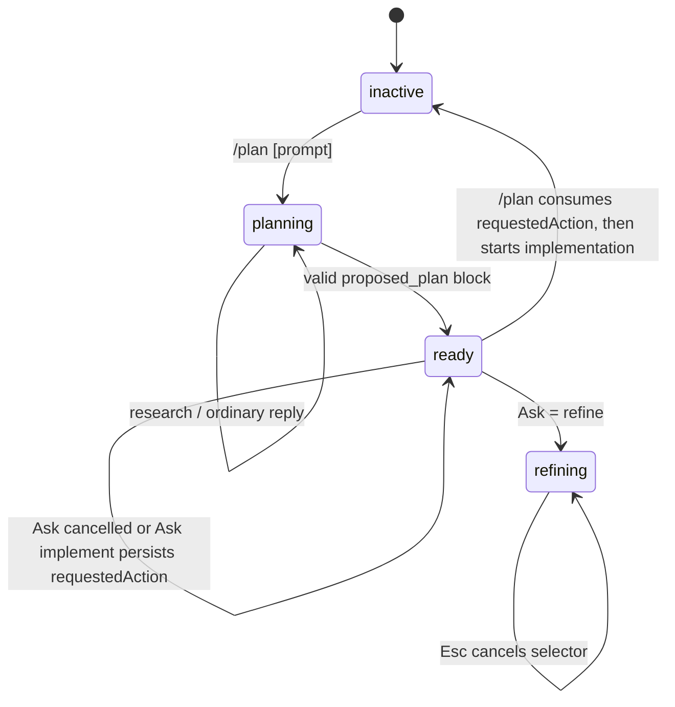

# pi-basics Plan Mode 高层方案（Review Gate）

> Archived plan: retained for implementation history. Current behavior is defined by source, tests, and `packages/pi-basics/README.md`.

> 本版按最新决策重写。Plan Mode **不注册新 tool**；完成计划后复用既有 `ask` 做一次用户动作选择。本文是边界与 Review 入口，不是已完成声明。

## 1. 一句话方案

在 `pi-basics` 增加内建 `/plan` 协作状态：模型通过 prompt 先调查，最终以约定的 `<proposed_plan>` Markdown block 提交计划；Plan Mode 将计划结果保存为可定位的 session artifact，并自动调用既有 Ask UI，让用户选择 refine、implement (new) 或 implement (compact)。Refine 立即进入 refinement；implementation 选择记录为待执行动作，用户下一次 `/plan` 在 command-safe context 中执行。进入 refine 后不再自动 Ask，用户用 `/plan` 选择实施或 `/plan edit` 继续修改；`Esc` 取消 selector 并回到 refine。

Plan Mode 初版不重写 active tools、不拦截 bash、不新增安全 policy；权限约束由 Plan prompt 负责，明确这不是 sandbox。

## 2. 调研结论与取舍

已研究：

- [Plannotator](https://github.com/backnotprop/plannotator)，revision `3b3c3c3819759b8959bdcaee5be39adb7832e382`：计划 artifact、计划 URL、审批/拒绝反馈、session phase。
- [pi-extensions/pi-plan-mode](https://github.com/narumiruna/pi-extensions/tree/main/extensions/pi-plan-mode)，revision `0606337fc258b38331f025f6e63e6a882f181686`：`<proposed_plan>` 兼容解析、active/ready flow、completion 后 action UI。
- `@bacnh85/pi-plan@0.5.9`，npm `gitHead` `23295d4af56750ea58b93488a82cf4691767326f`：plan→approve→implement(new/current) workflow；没有可直接依赖的 package test files。

| 方案 | 评价 | 决策 |
|---|---|---|
| A. assistant plan block + session artifact + existing Ask | 无新 tool；保留计划 URL；能复用 Ask 的 TUI/RPC/cancel 语义 | **采用** |
| B. `plan_mode_complete` structured tool | completion 边界清楚，但违反“不新增工具” | 不做 |
| C. plan file + browser review | URL/annotation 强，但引入 filesystem、server、browser 与额外权限 | 不做 v1 |
| D. 只靠普通 prose、无 completion marker | 没法区分调查回答与完成计划 | 不采用 |

## 3. 用户可见 contract

### 3.1 Commands

只支持以下 command shape：

```text
/plan [prompt]
/plan
/plan edit
/plan show
```

- `/plan <prompt>`：inactive 时进入 Plan Mode 并提交 prompt；planning/refining 时继续给模型 planning/refinement instruction。
- `/plan`：inactive 时进入；有 completed plan 时打开 action selector：`Implement (new)`、`Implement (compact)`、`Exit`。selector 被 `Esc` 取消时回到 refine，不执行任何动作。
- `/plan edit`：明确进入 refine 状态并发送 refinement instruction；之后模型可以生成新的 plan block、替换旧 plan artifact。不会自动再次 Ask。
- `/plan show`：显示当前 plan 与 plan URL，不触发 model turn。
- 不新增 `/plan implement`、`/plan exit`、`/plan tools`、`/plan approve`、`--plan`、快捷键、aliases。

### 3.2 Initial completion flow



当 planning turn 的最后 assistant message 包含唯一、合法、非空的 `<proposed_plan>` block：

1. 提取完整 Markdown plan，写入 `pi-basics-plan` custom message/session artifact。
2. 找到 artifact `entryId`，生成 plan URL。
3. 自动调用既有 Ask interaction，问题 context 必须包含 plan URL。
4. Ask 选项固定为：`Refine`、`Implement (new)`、`Implement (compact)`。
5. Ask 取消、UI unavailable 或 URL 无法生成时，保持 ready，不猜测用户决定。
6. Ask 选择 Refine 时立即进入 refining；选择 Implement 时仅持久化 requested action 并显示“run `/plan` to continue”。Pi 只允许 user-initiated command context 创建 session，不能从 `agent_end` 自动执行 `newSession()`。

`Refine` 后不自动触发 Ask。模型继续能修改/替换 plan artifact；用户通过 `/plan` 再选择 implement 或 exit。

### 3.3 Plan URL

Plan URL 是当前 session plan artifact 的稳定引用：

```text
file://<session-file>#<plan-entry-id>
```

使用 `sessionManager.getSessionFile()` 和 `pathToFileURL()` 生成，fragment 使用真实 session entry id。若 session 未持久化、无法取得 entry id 或 URL resolver 失败，不生成伪 URL，也不自动 Ask；显示明确提示并保持 Plan Mode。

Ask 调用必须把 URL 放进 existing Ask questionnaire 的 `context`，并在问题文案中说明该 URL 是当前完整 plan。实施 prompt 同样携带 URL；new session 可读取 parent session file。

## 4. 推荐范围

### 保留
- `PlanFeature` runtime phase：`inactive`、`planning`、`ready`、`refining`；`ready + requestedAction` 表示等待下一次 `/plan` command 执行 implementation。
- assistant message 的唯一 completion marker：一份完整、单独、非空的 `<proposed_plan>` block；重复、嵌套、未闭合、多个 block 均视为普通回复/错误，不触发 Ask。
- `pi.sendMessage({ customType: "pi-basics-plan", content: plan, display: true })` 作为 plan artifact；不注册 tool。
- 通过现有 Ask module 的内部 interaction seam 自动显示选择题，复用其 TUI、RPC fallback、cancel、abort 和 session cleanup。
- Ask context 与实施 prompt 附上 plan URL。
- `/plan show` 显示 plan 和 URL；`/plan edit` 进入 refinement。
- Implement (new) 使用 Pi command context 的 `ctx.newSession()`；Implement (compact) 在同一 command context 调用 `ctx.compact()` 后于当前 session 继续实施。初始 Ask 的 implementation 选择必须经下一次 `/plan` command 落地。
- session custom boundary 保存 phase、plan entry ID、plan URL、是否已触发 initial Ask 与可选 requested action；plan 正文只存于 artifact message。
- statusbar extension status：`Plan · active`、`Plan · ready`、`Plan · refine`。

### 不做

- 不注册 `plan_mode_complete`、`plan_mode_question` 或任何其他 Plan-specific tool。
- 不调用 `setActiveTools()`，不扩展 tool activation coordinator，不做 source-aware tool classification。
- 不拦截 `edit`、`write`、`bash`、Git、custom tools；prompt 是 v1 主要权限边界，不宣称安全防线。
- 不做 browser review、annotation、plan diff、filesystem 独立 plan directory、Git rewind、自动 verify/review、handoff workflow、thinking-level config。
- 不在 refine 完成后自动再次 Ask；用户必须通过 `/plan` 触发 implement/exit selector。
- 不把 `Esc` 做成全局 shortcut；只处理 `/plan` action selector 的取消。
- 不兼容多种 prose 规则；只认单一 canonical block，避免误触发。

## 5. pi-basics 整合边界

- 不修改 `pi-extcore`、`pi-loadout`、Todo、Goal 或 Statusbar renderer。
- 修改 Ask module 仅增加 module-private `requestAsk(questionnaire, runtime)` seam；现有 `ask` tool execute 与 Plan 自动选择共用同一个 interaction implementation，不增加注册工具或 public SDK。
- Plan artifact 以 Pi custom message entry 参与 session context；其 entry id 是 URL fragment 和 state reference。
- `agent_end` 负责解析最后 assistant message；只在 `planning` 且 `initialAskPending` 时自动 Ask。`refining` 中只保存新 plan，不 Ask。
- Implement (new) / (compact) 只从 `/plan` command context 执行；initial Ask 的选择先 durable-record，不能在 `agent_end` 直接执行 Pi session action。失败时保留 artifact、URL 和可恢复的 refine state。
## 6. Review 决策点

| 决策 | 推荐 |
|---|---|
| Completion | 唯一 `<proposed_plan>` assistant block |
| 新工具 | 不新增 |
| 自动用户选择 | existing Ask internal interaction |
| Ask options | Refine / Implement (new) / Implement (compact)；implementation choice记录为 pending，下一次 `/plan` 执行 |
| Refine 后行为 | 不自动 Ask；`/plan` 打开 implement/exit selector |
| Plan URL | `file://session-file#entry-id` |
| New | command-context `ctx.newSession()`，带 parent session 与 plan URL |
| Compact | command-context `ctx.compact()` 后 current session implementation |
| Esc | 取消 `/plan` selector，回 refine |

## 7. 当前 baseline 前置条件

当前工作树中 `packages/pi-basics/src/index.ts` 与 `packages/pi-basics/README.md` 不在可见 source list，实施前必须确认真实 extension entry、Ask lifecycle owner 与 session message API。另需确认 host 的 `sendMessage` 后能从 current branch 找到 custom message `entryId`；若未持久化，Plan URL 要 fail closed，而不是编造 URI。

详细设计见 [`design.md`](./design.md)，实施步骤见 [`implementation.md`](./implementation.md)。
