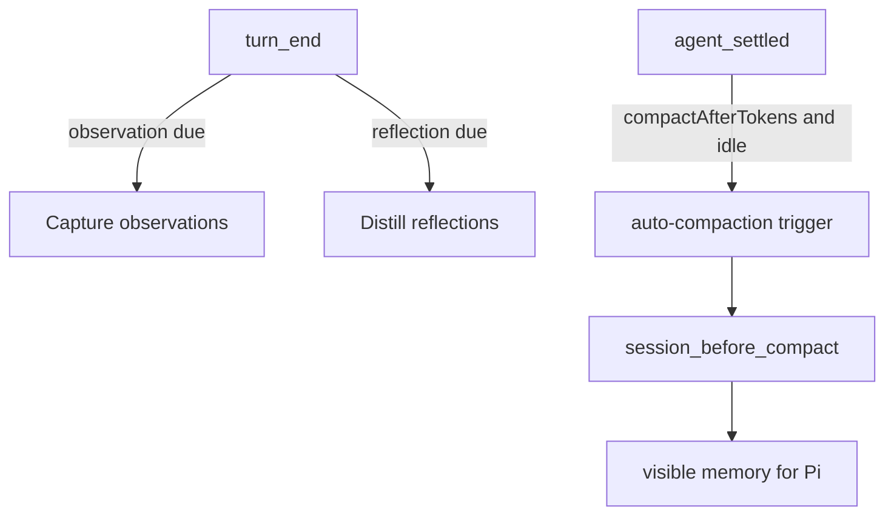

# @hheei/pi-ext-memory

> **Make Pi sessions feel endless.**

`@hheei/pi-ext-memory` 是 HEPI Monorepo 中基于 [pi-observational-memory](https://github.com/elpapi42/pi-observational-memory) 构建与维护的会话观测式记忆扩展。
它通过分层的 Observations（观测）与 Reflections（反思）机制，在后台持续提炼会话中的关键事实与决策，从而在执行上下文压缩（Compaction）时保持会话连贯性，显著减少模型上下文退化。

---

## 核心特性

- **后台渐进式记忆提炼**：在后台异步捕获会话中的具体事件（Observations），并提炼为长期稳定的事实（Reflections），避免在压缩时临时耗时总结。
- **瞬时 Compaction 渲染**：压缩触发时，直接渲染已准备好的记忆块，压缩过程几乎瞬时完成。
- **证据可溯源（Source-backed Recall）**：每条观测和反思附带 12 字符的 ID，Agent 可使用 `recall` 工具快速检索对应原始会话片段证据。
- **活跃记忆修剪（Dropper）**：后台基于覆盖率、时效性和重要度自动修剪活跃观测池，防止记忆自身发生膨胀。
- **Monorepo 统一集成**：完全接入当前工程的统一类型校验（`pnpm run typecheck`）与测试套件（`pnpm test`），无需独立维护工具链。

---

## 开发与使用

### 构建与打包

在仓库根目录运行：

```bash
# 全局类型检查（包含该包）
pnpm run typecheck

# 运行本包测试
pnpm exec vitest run packages/pi-ext-memory/test/

# 构建扩展产物
pnpm --filter @hheei/pi-ext-memory run build
```

### 加载扩展

在启动 Pi 时显式加载扩展入口：

```bash
pi --extension ./packages/pi-ext-memory/dist/extension.js
# 或在开发模式下直接加载源码：
pi --extension ./packages/pi-ext-memory/src/index.ts
```

---

## 配置说明

Settings live under the `pi-ext-memory` namespace in either:

* Global: `~/.pi/agent/ext_settings.json`
* Project-local: `<cwd>/.pi/ext_settings.json`

Project settings override global settings.

The namespace was renamed from `observational-memory` to `pi-ext-memory`. The old key is no longer read, so rename it in both files after upgrading.

`PI_OBSERVATIONAL_MEMORY_PASSIVE` can override only `passive`.

A typical config:

```json
{
  "pi-ext-memory": {
    "observeAfterTokens": 10000,
    "reflectAfterTokens": 20000,
    "compactAfterTokens": 81000,
    "compactAfterTokensMode": "calibrated",
    "compactAfterTokensRatio": 0.68,
    "observationsPoolMaxTokens": 20000,
    "observationsPoolTargetTokens": 10000,
    "agentMaxTurns": 16,
    "model": {
      "provider": "openrouter",
      "id": "google/gemma-4-31b-it",
      "thinking": "low"
    },
    "showWorkerNotifications": true,
    "passive": false,
    "debugLog": false
  }
}
```

Most users can start with the defaults and tune only if they have a specific reason.

If your memory model is a local llama.cpp server, size `agentMaxTokens` so that a worst-case request (observer chunk + prior memory + system prompt + the full response budget) fits inside the server's context: slot KV is shared between the main session's retained cache and concurrent sub-agent requests, so an over-budget sub-agent request fails with `500 "Context size has been exceeded."` and the affected memory run aborts. For example, on a 64K-slot server, pairing `"agentMaxTokens": 8192` with a low `observerChunkMaxTokens` keeps sub-agent requests well inside the window.

### Scaling compaction to the model's context window

By default `compactAfterTokensMode` is `"calibrated"`, so the proactive
compaction trigger uses the fixed `compactAfterTokens` estimated source-entry
threshold (81,000 by default). This preserves the pre-PR #40 compaction metric
for typical ~128K–200K context models.

On a large-context model (e.g. 1M tokens) the calibrated default preempts
compaction at ~81K, wasting most of the window. Switch to `"ratio"` mode to let
the trigger scale with the active model's `contextWindow`:

```json
{
  "pi-ext-memory": {
    "compactAfterTokens": 81000,
    "compactAfterTokensMode": "ratio",
    "compactAfterTokensRatio": 0.5
  }
}
```

In ratio mode the effective threshold is
`floor(model.contextWindow * compactAfterTokensRatio)` (clamped to a minimum of
1). With the example above, a 1,000,000-token window compacts after about
500,000 estimated source-entry tokens after the latest compaction boundary; a
200,000-token window uses about 100,000. The threshold counts source entries,
not Pi's system prompt, tool schemas, or provider accounting. Pi's native
window-pressure compaction remains independent.

`compactAfterTokensRatio` is user-tunable precisely because **context window ≠
attention**. Some models advertise a large window but degrade at long range; set
a lower ratio (e.g. `0.4`) to compact earlier on those, or a higher ratio
(e.g. `0.7`) on models that stay sharp. The default ratio is `0.68`.

`compactAfterTokens` is always retained as the fallback: in `"calibrated"`
mode it is the threshold directly, and in `"ratio"` mode it is used whenever
the active model's `contextWindow` is unavailable (undefined, 0, or negative),
so compaction still triggers safely. `/om status` shows the resolved threshold
on the `Next compaction` line regardless of mode.

### Defaults

| Setting                     | Default       | Meaning                                                                                           |
| --------------------------- | ------------- | ------------------------------------------------------------------------------------------------- |
| `observeAfterTokens`        | `10000`       | Raw/source token threshold for observation runs.                                                  |
| `observerChunkMaxTokens`    | derived       | Max estimated tokens serialized into one observer chunk (minimum `256`). Unset: `floor(contextWindow * 0.2)` of the resolved memory model, or `60000` when the window is unknown. Larger backlogs drain oldest-first; a single over-budget source is sent as a marked head/tail excerpt while the original source remains in the session ledger. |
| `reflectAfterTokens`        | `20000`       | Raw/source token threshold for reflection runs; successful reflection creates dropper opportunities. |
| `compactAfterTokens`        | `81000`       | Estimated source-entry threshold for proactive auto-compaction, counted after the latest compaction boundary. |
| `compactAfterTokensMode`    | `"calibrated"`| `"calibrated"` uses `compactAfterTokens` directly. `"ratio"` scales the source-entry threshold by the active model's `contextWindow`. |
| `compactAfterTokensRatio`   | `0.68`        | In `"ratio"` mode, the threshold is `floor(contextWindow * ratio)`. Tunable because large windows do not always mean strong long-range attention. Must be in `(0, 1)`. |
| `observationsPoolMaxTokens` | `20000`       | Observation-token budget used for compaction full-fold pressure.                                  |
| `observationsPoolTargetTokens` | half of max | Active observation target used by post-reflection dropper maintenance and by the pool enforcer, and the observation share of the rendered memory budget.                            |
| `memoryMaxTokens`           | derived       | Hard upper bound on how many tokens of memory stay visible. Unset: `min(floor(effective trigger * 0.5), floor(contextWindow * 0.1))`, never below `4000`. Caps the rendered compaction summary, the dropper's target and what the memory agents read. See [Memory budget](#memory-budget). |
| `agentMaxTurns`             | `16`          | Shared turn cap for background memory-agent loops.                                                |
| `agentMaxTokens`            | `32000`       | Maximum output tokens requested for memory-agent loops (observer/reflector/dropper), clamped to the model's own `maxTokens` when available. Lower it for local servers with a modest context window, e.g. `8192`. |
| `model`                     | session model | Optional memory-worker model override: `{ provider, id, thinking }`.                              |
| `showWorkerNotifications`   | `true`        | Shows routine observer, reflector, and dropper progress notifications. Warnings and errors are unaffected. |
| `passive`                   | `false`       | Disables proactive background observation, reflection, maintenance, and auto-compaction triggers. |
| `debugLog`                  | `false`       | Writes opt-in per-session extension debug events to Pi's agent directory.                         |

Valid `model.thinking` values are:

* `off`
* `minimal`
* `low`
* `medium`
* `high`
* `xhigh`
* `max`

If no `model` is configured, memory workers use the session model, including custom `pi.registerProvider` APIs such as `cursor-sdk`. You do not need a second built-in provider (OpenAI, OpenRouter, …) for observational memory to run. Set `model` only when you want cheaper or faster workers than the coding agent.

Set `showWorkerNotifications` to `false` to hide routine worker start and completion messages (including deliberate-empty observer info messages). Model fallback/unavailability, worker failures (including observer stream errors), compaction notifications, the pool enforcer's reclaim notice (a memory change with no model in the loop), and explicit `/om` subcommand output remain visible.

`observationsPoolMaxTokens` and `observationsPoolTargetTokens` intentionally describe different pools. Max tokens control when compaction performs a full fold over visible memory. Target tokens control the folded active observation pool that the dropper maintains after successful reflection, and the observation share of the rendered memory budget. If the target is omitted, it defaults to half of max.

### Memory budget

Rendered memory is bounded, so compaction always shrinks the context instead of replacing it with a summary that can be larger than the window. Without that bound a long session drifts into a loop: the deterministic summary grows past the trigger, Pi compacts again immediately, and the request eventually overflows and aborts.

The budget is derived at compaction time:

```
softLimit    = min(compactAfterTokens, contextWindow − Pi's reserveTokens)
available    = softLimit − retained tail tokens − system prompt tokens
renderBudget = clamp(available × 0.5, 4000, memoryMaxTokens)
```

Pi reports the tail it keeps after the cut (`firstKeptEntryId` onward), so a session retaining a large tail gets a smaller memory budget; an overflow-recovery compaction halves it again. `memoryMaxTokens` pins the cap when the derived one is wrong for a workload. Inside the budget, selection is deterministic — uncovered observations first, then relevance, then newest; reflections keep the session's first eight entries as anchors and then the newest — and trimmed lines are not deleted, only hidden until recalled by id.

The same view is what the memory agents read, so their prompts stay bounded too; the dropper's drop budget is still sized from the real active pool, so visibility never disables the model-judged pass. `/om status` reports the cap, active memory against it, and the last render's tokens, trimmed lines, and retained tail; the compaction entry records it as `details.budget`. A trim that costs a quarter or more of the memory lines reports one notification.

Trimmed lines stay in the ledger, so the ledger is bounded too: above half again the cap, a model-free enforcer reclaims non-critical observations down to their target and writes one `om.observations.dropped` entry. It ranks by observation `kind` first — `progress` narration leaves before facts, and both before user assertions and decisions — which is also the order the renderer prefers to trim in.

Reflections have no eviction path: they leave active memory only when the reflector replaces them. In the same `record_reflections` call that proposes a merged reflection it lists the ids it replaces in `supersedes`, and the stage writes one `om.reflections.dropped` tombstone. A reflection therefore never leaves active memory without a replacement — an invalid proposal produces no tombstone, unknown ids are ignored, and proposing content identical to an existing reflection still carries its `supersedes`, so the pool can converge on wording that already exists. Superseded reflections keep their ledger records (`/om view full` still shows them) but stop counting toward the cap and stop providing coverage; the surviving reflection keeps its own supporting observation ids (the ledger has no update path), so the replaced reflection's observations just lose their coverage — which makes them harder, not easier, to trim. A merge that proposes new content inherits the supporting ids of what it replaces, so merging still has evidence when no observation is left to cite, and each proposal's supersedes stands on its own: one proposal whose replacement can never become active is skipped while the other merges in the same call still retire theirs. The reflector is given its share of the render budget (`REFLECTION BUDGET`), measured against the whole active pool rather than the trimmed view, and is told to merge before adding when it is over.

Dropper pruning balances age, relevance, and reflection coverage. Relevance is importance/resistance, not a permanent active-memory pin: `critical` observations require the strongest evidence but can be dropped when they are older and safely represented by reflections, superseded by newer memory, redundant, or obsolete. Dropper input annotates each active observation with deterministic coverage evidence: `none`, `partial`, or `strong`; coverage guides model judgment and is not an automatic drop rule. Dropping removes observations from active memory, not ledger history.

When `debugLog` is enabled, debug events are written as local NDJSON files under Pi's agent directory. Normal sessions write to `observational-memory/debug/<session-id>.ndjson`; contexts without a session id fall back to `observational-memory/debug.ndjson`. Debug rows include `sessionId` and per-consolidation `runId`, so a session file can still be filtered to one observer/reflector/dropper run.

For details and tuning guidance, see [`docs/configuration.md`](docs/configuration.md).

---

## Commands and agent tool

| Surface             | What it does                                                                                                                                    |
| ------------------- | ----------------------------------------------------------------------------------------------------------------------------------------------- |
| `/om`               | Reports whether observational memory is on or off for this session.                                                                             |
| `/om on` / `/om off`| Turns the session gate on or off. The state is a ledger entry on the current branch, so `/tree` switches and `/resume` restore it automatically. |
| `/om status`        | Shows gate/passive mode, memory counts (observations recorded/dropped/active/visible, reflections recorded/superseded/active/visible, plain `+N` / `-N` visible/full drift suffixes), progress clocks, visible and active observation pool pressure, memory budget, worker spend, in-flight state, last worker errors, and a timeline strip of the branch. |
| `/om consolidate`   | Runs one consolidation cycle now (observer → reflector → dropper) instead of waiting for the token thresholds.                                   |
| `/om compact`       | Compacts the session now instead of waiting for the compaction threshold or the idle timer, using the memory summary rather than Pi's native summarizer. |
| `/om view`          | Shows current visible memory and attempts to copy the rendered memory text to the clipboard.                                                   |
| `/om view full`     | Shows the full current memory state for the branch and attempts to copy the rendered memory text to the clipboard.                             |
| `recall` agent tool | Recovers source evidence for a 12-character observation/reflection id on the current branch. It is not semantic search or a transcript browser. |
| `mcp__hindsight__*` tools | Opt-in cross-session long-term memory via native MCP server (see [Hindsight long-term memory](#hindsight-long-term-memory)). When `hindsight.enabled` is `true`, registers the `hindsight` MCP server with direct exposure for key knowledge tools (`get_knowledge_base_tree`, `search_knowledge_base`, `get_knowledge_page`, `recall`, `reflect`, `retain`) and deferred exposure for all other server tools. Withdrawn when disabled. |

Tab completion after `/om ` offers these subcommands (and `full` after `/om view `), through the shared
`subcommandCompletions` helper of `@hheei/pi-ext-core`.

The `recall` result body reuses the shared status glyphs instead of ASCII marks: its first line is
`󰄴 success · N observations · M sources · ~K tokens`, a result that came back short says what stopped
it (`󰀪 not found`, `󰀪 disabled`), every returned item gets an aligned `󰄴 reflection` / `󰄴 observation` /
`󰄴 source` row, and every caveat gets an `󰀪 note` row (a dropped observation, a missing source, an id
collision). The frame above the body draws the same glyph for the same result.

### Session gate vs. passive mode

The two switches are orthogonal:

* **Gate (`/om on` / `/om off`)** decides whether observational memory runs at all in this session. While it is off, the hooks return immediately, idle timers are dropped, and `recall` answers with a disabled notice instead of a memory. The gate is stored as an `om.gate` ledger entry on the branch, so switching branches with `/tree` or resuming a session restores the state that branch recorded. A branch that never recorded one is on.
* **`passive`** is a configuration value. With the gate on and `passive: true`, automatic background workers and auto-compaction stay idle while `/om consolidate`, `/om compact`, `/om view`, and `recall` remain available.

### Manual commands

`/om consolidate` shares the same in-flight lock as the automatic path: it declines while another consolidation or a compaction is running, and it declines when there is nothing uncovered and no memory yet. It ignores the `observeAfterTokens` / `reflectAfterTokens` thresholds, but the dropper still only removes observations when the active pool is over `observationsPoolTargetTokens`.

`/om compact` waits for an in-flight consolidation to finish (so the summary covers the newest memories), then refuses to start when nothing new arrived since the last compaction or when the fold holds no observations and no reflections. That refusal is deliberate: an empty projection makes the compaction hook decline ownership and Pi would fall back to its slow, unbounded native summarizer.

### Worker spend and timeline

`/om status` reports provider-reported worker spend for the session (`usage.cost.total` accumulated per worker call) and appends a timeline strip of the current branch:

```text
timeline legend:  ▓ compacted   ▒ memory pool   ░ raw backlog   ┊ cut   ▶ tip
```

`▓` is history a compaction already replaced with a memory summary, `▒` is history the observer has covered that still lives as observations, `░` is raw backlog waiting for the observer, `┊` marks a compaction cutoff, and `▶` is the branch tip. The strip is scaled to the terminal width, and cost is run-time telemetry only: it is never written to the ledger and never rolls back on a `/tree` switch, because the API calls it accounts for already happened.

`/om view` copies only the rendered memory content. The success/failure line shown in Pi is not included in the clipboard text. Copying goes through Pi's own clipboard helper, so a remote SSH session reaches the client clipboard over OSC 52 and a Linux desktop without `wl-clipboard`/`xclip`/`xsel` still prints the memory view with a warning that names the missing tool. Before the first V3 compaction, visible memory can be empty because nothing has been folded into `om.folded` details; use `/om view full` to inspect recorded branch memory.

---

## How it works in 60 seconds



The high-level lifecycle:

1. Pi session continues normally.
2. The extension captures observations from the session as work happens.
3. Durable reflections are distilled in the background.
4. When compaction time arrives, Pi receives prepared memory quickly.
5. The agent continues with a compact but useful view of the work so far.

The important part: compaction does not need to rethink the whole session from scratch.

The proactive compaction threshold counts estimated source-entry tokens after
the latest compaction boundary. It includes source entries retained by
`firstKeptEntryId` and newer source entries, while memory ledger entries and
compaction metadata contribute zero. `/om status` uses the same metric. Pi's
own window-pressure compaction remains independent.

---

## Current V3 behavior

Current behavior:

* **Observation-centered memory.** The extension records useful session observations while you work.
* **Durable reflections.** The extension distills stable facts that help the agent stay oriented over time.
* **Fast compaction.** When prepared V3 memory exists, `session_before_compact` renders it without calling a model or waiting for background workers. An empty V3 projection delegates to Pi's native summarizer instead of replacing prior context with an empty summary.
* **Background memory work.** Observation and reflection work run from `turn_end` when their token clocks are due; dropper work runs only after successful reflection and prunes the folded active observation ledger toward `observationsPoolTargetTokens`.
* **Source-backed recall.** Observations and reflections can be traced back through the `recall` tool.
* **Visible/full views.** `/om view` shows visible memory and `/om view full` shows the full current memory state. Use `/om status` for visible-vs-full drift and for the separate visible observation pool vs active observation pool.
* **No V2 compatibility layer.** Old V2 settings and memory entries are ignored rather than migrated.

---

## Hindsight long-term memory

Observational memory is session-scoped: it compacts the conversation you are in. Hindsight adds **cross-session, repository-level memory** on top of it, and is **off unless you explicitly turn it on** (`enabled: true`). When the option is disabled, `pi-ext-memory` registers no extension-owned MCP server, reads no Hindsight config file, and makes no network requests.

External file-configured MCP servers (e.g. configured in `~/.pi/agent/mcp.json` or project `.pi/mcp.json`) remain completely independent and functional regardless of whether `pi-ext-memory`'s Hindsight feature is enabled or disabled.

### Prerequisites

* Requires **Pi >= 1.0.1**.
* Requires Pi's **`builtin:mcp`** extension enabled.

### Configuration

```json
{
  "pi-ext-memory": {
    "hindsight": {
      "enabled": false,
      "apiUrl": "https://api.hindsight.vectorize.io",
      "mcpUrl": "https://api.hindsight.vectorize.io/mcp",
      "apiToken": "",
      "bankId": "",
      "autoRecall": true,
      "retainSessions": true,
      "readTimeoutMs": 15000,
      "maxMemoryChars": 8000,
      "configPath": "~/.hindsight/coding-agent.json"
    }
  }
}
```

Values are resolved in this order, each layer overriding the ones below it:

1. `pi-ext-memory.hindsight` in project `ext_settings.json`
2. `pi-ext-memory.hindsight` in global `ext_settings.json`
3. `HINDSIGHT_API_URL`, `HINDSIGHT_API_TOKEN`, `HINDSIGHT_BANK_ID`, `HINDSIGHT_MCP_URL`, `HINDSIGHT_CONFIG`
4. `banks.<bankId>` in the fallback file (its `retainTags` and `retainMetadata` are inherited)
5. The fallback file's top-level `apiUrl` / `mcpUrl` / `bankId`
6. The defaults above

`enabled` is only read from settings, never from the environment.

* **Independent MCP endpoint and ports:** `mcpUrl` configures the streamable HTTP MCP endpoint (Pi streamable HTTP MCP transport, not SSE). It defaults to `<apiUrl>/mcp`. The ports for `apiUrl` and `mcpUrl` are independent and are not inferred from each other. If your REST API runs on port 38888 and your MCP endpoint on port 38887, set `mcpUrl` (or `HINDSIGHT_MCP_URL`) explicitly to the MCP endpoint (e.g. `http://host:38887/mcp` or `http://host:38887`).
* **Session bank routing:** The extension dynamically pins the session MCP connection to the single-bank endpoint `/mcp/{bank_id}/`.

### Bank routing and repository isolation

The bank is chosen by the first rule that applies:

1. `hindsight.bankId`
2. `mapPathToBank` in the fallback file, longest matching path prefix
3. `bankIdTemplate` in the fallback file, with `{gitProject}` replaced by the repository name
4. The fallback file's `bankId`
5. `coding-agent::{gitProject}`, derived from the git root

The repository name is the git root directory name, so every subdirectory of a checkout resolves the same way.

A bank derived per repository (rules 3 and 5) is a **dedicated bank**. Any other bank is treated as a **shared bank**.

* **Dedicated banks:** Provide strong repository isolation by keeping memory, knowledge pages, and notes in physically distinct banks.
* **Shared banks (no repo filter on MCP tools or knowledge pages):** Native MCP tools (`mcp__hindsight__*`) communicate directly with `/mcp/{bank_id}/` and operate **bank-wide without repository filtering**. Similarly, automatic SDK knowledge-page search in Hindsight is bank-wide (Hindsight knowledge pages have no repository tag filter). Only automatic SDK background session writeback stamps turns with a `repo:<name>` tag. Therefore, shared banks are **not repository-isolated** for knowledge pages or MCP tool operations. Always use dedicated banks when complete isolation between repositories is required.
* **Diagnostics:** Run `/om status` to inspect effective bank routing, isolation mode, endpoints, token status, external file config overrides, auto-recall, retention, and writeback state. Never logs or prints auth tokens.

### Behavior

* **Stable guide.** The preamble explaining the memory and its tools goes into its own `hindsight-preamble` prompt section, together with a snapshot of the knowledge-page index. Every turn supplies the same text so Pi keeps the section. Resume reuses the active branch's persisted guide when its repository, bank, scope, and guidance still match; otherwise a new guide is built. Remote page changes do not rewrite an existing guide on resume.
* **Later turns.** With `autoRecall`, a knowledge-page search runs for the prompt and up to `maxMemoryChars` characters of escaped, untrusted-by-construction hits land in a `hindsight-recall` section inside a `<memory>` container. Pi sends a section only when its text changed, and an unchanged section is never repeated as a prompt update — the request itself still carries whatever the host and provider keep in context. Retrieval failures are silent. Deep `mcp__hindsight__reflect` synthesis is never automatic: it stays an explicit tool call.
* **Injection log.** Every turn that injects something appends a `memory-info` transcript entry naming what went in. It lists the recalled page titles (`󰄴` for a page that did reach the prompt), expands (Ctrl+O) to each page id and the recalled snippet the model was given, and marks a container that had to be cut to `maxMemoryChars` with a `󰀪` warning row. It is native Pi territory: visible immediately, kept by resume, and never part of the model's context.
* **Native write cache invalidation.** Whenever a mutating MCP tool (such as `mcp__hindsight__retain` or custom authoring tools without `readOnlyHint`) is invoked, `pi-ext-memory` automatically invalidates the auto-recall cache so subsequent turns immediately reflect the new memory.
* **Error normalization.** Business errors returned inside MCP `CallToolResult` payloads are detected and normalized to `isError: true` on both the outer event and the inner structured content wrapper.
* **Turn end.** The run's user/assistant turns are reduced to a compact transcript (tool results and injected memory dropped, failed or aborted responses skipped) and written back in order, one request at a time. The operation id is derived from the bank, session, and batch content, so a retry or a repeated `agent_end` folds server-side instead of duplicating.
* **Session end.** Pending writeback is flushed within a five-second grace period, then cancelled. A failed writeback is recorded and never interrupts the conversation.

### Tools

Tools are provided by the native Hindsight MCP server under the `mcp__hindsight__` namespace.

* **Upstream authoritative server:** The Hindsight server is the sole authority for tool authoring, definitions, schemas, and execution logic. `pi-ext-memory` does not author or wrap tools, enabling future server-side tool additions to work out of the box without extension changes.
* **Exposure:**
  * **Direct exposure** (directly available in the model's context):
    * `mcp__hindsight__get_knowledge_base_tree`: Page hierarchy and structure of the knowledge base.
    * `mcp__hindsight__search_knowledge_base`: Semantic search across the bank's knowledge vault.
    * `mcp__hindsight__get_knowledge_page`: Fetch full markdown content of a page by path.
    * `mcp__hindsight__recall`: Fact and turn recall from long-term memory.
    * `mcp__hindsight__reflect`: Deep agentic reflection and cross-conversation synthesis over memory.
    * `mcp__hindsight__retain`: Store durable facts, decisions, and corrections (with content starting with `Correction: <topic>`).
  * **Deferred exposure:** All other tools provided by the Hindsight server are registered as `deferred` (loaded on demand via `tool_search` or callable via codemode scripts).
* **Execution & timeout:** MCP tool calls run through Pi's native MCP client with a 60-second timeout (`timeout: 60`), accommodating deep reflection queries without client-side budget hacks.

---

## Migrating from V2

V3 is **not backwards compatible** with V2 memory or settings.

What this means in practice:

1. **Update your settings.** V2 keys are silently ignored by V3. Keeping the old names will make V3 fall back to defaults.
2. **Start a new clean Pi session after upgrading.** Existing sessions may still contain old visible compaction-summary text until a new V3 compaction replaces what the agent sees, so a clean session is the safest migration path.
3. **Do not expect rollback continuity.** If you create V3 memory entries and then roll back to V2, V2 will not understand the V3 memory format. Treat that as memory reset/visibility loss.

### Settings migration table

| V2 setting                   | V3 setting                                              | What to do                                                                                                                                     |
| ---------------------------- | ------------------------------------------------------- | ---------------------------------------------------------------------------------------------------------------------------------------------- |
| `observationThresholdTokens` | `observeAfterTokens`                                    | Rename. Same rough role: observation cadence based on raw/source tokens.                                                                       |
| `compactionThresholdTokens`  | `compactAfterTokens`                                    | Rename. Same rough role: proactive compaction cadence.                                                                                         |
| `reflectionThresholdTokens`  | `reflectAfterTokens`, `observationsPoolMaxTokens`, and/or `observationsPoolTargetTokens` | Split. Use `reflectAfterTokens` for reflection scheduling, `observationsPoolMaxTokens` for compaction full-fold pressure, and `observationsPoolTargetTokens` for dropper active observation maintenance. |
| `compactionModel`            | `model`                                                 | Move `{ provider, id }` to `model`.                                                                                                            |
| `thinkingLevel`              | `model.thinking`                                        | Move under `model`.                                                                                                                            |
| `observerMaxTurnsPerRun`     | `agentMaxTurns`                                         | Replace with the shared memory-agent turn cap.                                                                                                 |
| `reflectorMaxTurnsPerPass`   | `agentMaxTurns`                                         | Replace with the shared memory-agent turn cap.                                                                                                 |
| `prunerMaxTurnsPerPass`      | `agentMaxTurns`                                         | Replace with the shared memory-agent turn cap.                                                                                                 |
| `compactionMaxToolCalls`     | none                                                    | Remove. There is no V3 alias.                                                                                                                  |
| `passive`                    | `passive`                                               | Keep if desired.                                                                                                                               |
| `debugLog`                   | `debugLog`                                              | Keep if desired.                                                                                                                               |

Example V2 config:

```json
{
  "observational-memory": {
    "observationThresholdTokens": 1000,
    "compactionThresholdTokens": 50000,
    "reflectionThresholdTokens": 30000,
    "compactionModel": { "provider": "openrouter", "id": "google/gemma-4-31b-it" },
    "thinkingLevel": "low",
    "observerMaxTurnsPerRun": 8,
    "reflectorMaxTurnsPerPass": 12,
    "prunerMaxTurnsPerPass": 12,
    "passive": false
  }
}
```

V3 equivalent:

```json
{
  "pi-ext-memory": {
    "observeAfterTokens": 10000,
    "reflectAfterTokens": 20000,
    "compactAfterTokens": 81000,
    "observationsPoolMaxTokens": 20000,
    "observationsPoolTargetTokens": 10000,
    "agentMaxTurns": 12,
    "model": {
      "provider": "openrouter",
      "id": "google/gemma-4-31b-it",
      "thinking": "low"
    },
    "passive": false
  }
}
```

---

## More docs

* [`docs/concepts.md`](docs/concepts.md) — vocabulary and V3 mental model.
* [`docs/how-it-works.md`](docs/how-it-works.md) — lifecycle, memory shapes, projections, and recall flow.
* [`docs/configuration.md`](docs/configuration.md) — all V3 settings and migration notes.

---

## Credits

Inspired by [Mastra's Observational Memory](https://mastra.ai/blog/observational-memory) research.

This is an independent implementation built for Pi's extension system.

---

## License

MIT
